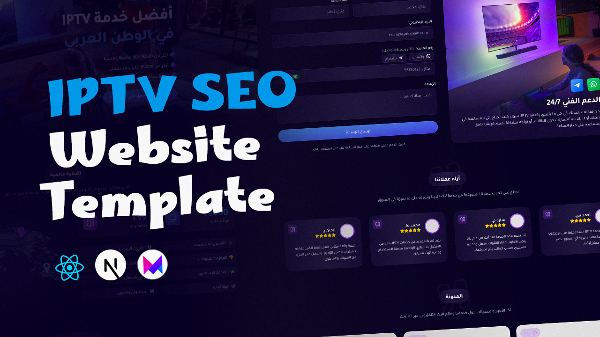

# MenaTV - Professional IPTV Website Template | Next.js & TypeScript



Transform your IPTV service with our high-conversion, SEO-optimized website template. Built with Next.js 15, TypeScript, and Tailwind CSS, it's perfect for IPTV providers looking to grow their subscriber base with a modern, fast-loading website.

## ✨ Key Features

- 🚀 **Built with Latest Technologies**
  - Next.js 15 with App Router
  - TypeScript for type safety
  - Tailwind CSS for styling
  - Framer Motion animations
  - Fully responsive design

- 🔍 **Advanced SEO Features**
  - Dynamic metadata generation
  - Structured data for rich snippets
  - RSS feed for blog posts
  - Optimized meta tags
  - Automatic sitemap generation
  - Social media meta tags
  - Schema.org markup
  - Built-in robots.txt
  - Customizable canonical URLs

- 📱 **RTL Support & Arabic Optimization**
  - Full RTL layout support
  - Arabic font optimization (Tajawal)
  - Bidirectional content handling

- 🎨 **Modern Design Elements**
  - Gradient effects
  - Glassmorphism UI
  - Smooth animations
  - Interactive components
  - Dark theme optimized

- 📊 **Conversion-Focused Sections**
  - Hero section with clear CTA
  - Pricing tables
  - Benefits showcase
  - Statistics display
  - Network coverage map
  - Testimonials carousel
  - FAQ section
  - Contact form

- 🛠 **Advanced Components**
  - Multi-country phone input
  - Dynamic blog section
  - RSS feed generation
  - Interactive pricing tables
  - Animated statistics
  - Device compatibility showcase

- ⚡ **Performance Optimized**
  - Optimized images
  - Lazy loading
  - Component-level code splitting
  - SEO-friendly structure
  - Fast page loads

## 📦 What's Included

- 📂 **Full Source Code**
  - Well-organized component structure
  - Clean and commented code
  - TypeScript definitions
  - Reusable components

- 📜 **Legal Pages**
  - Terms of Service page template
  - Privacy Policy template
  - Refund Policy template
  - GDPR-compliant structure
  - Customizable legal content

- 🎨 **Assets**
  - SVG icons
  - Optimized images
  - Placeholder content
  - Demo data structure

## 🚀 Getting Started

1. **Prerequisites**
   ```bash
   node.js >= 18.17
   npm or yarn or pnpm
   ```

2. **Installation**
   ```bash
   npm install
   # or
   yarn install
   ```

3. **Development**
   ```bash
   npm run dev
   # or
   yarn dev
   ```

4. **Build**
   ```bash
   npm run build
   # or
   yarn build
   ```

## 🎨 Customization

- Modifiable content through data files
- Flexible component structure
- Customizable animations
- Configurable layouts

## 📱 Browser Support

- Chrome (latest)
- Firefox (latest)
- Safari (latest)
- Edge (latest)
- Mobile browsers

## 📄 License

- Single license per project

## 🌟 Why Choose This Template?

1. **Save Development Time**
   - Ready-to-use components
   - Proven UI/UX patterns
   - Optimized for IPTV services

2. **Professional Design**
   - Modern aesthetics
   - Conversion-focused layout
   - Mobile-first approach

3. **Technical Excellence**
   - Clean code architecture
   - Performance optimized
   - SEO-friendly structure

---

## 🛒 Purchase

Ready to get started? https://wa.me/+21692607022 and get instant access to all features!
